# Spoonacular Recipes App

A cross-platform Flutter application for discovering, searching, and saving recipes using the Spoonacular API. The app supports Android, iOS, Web, Windows, macOS, and Linux platforms.

---

## Table of Contents

- [Features](#features)
- [Screenshots](#screenshots)
- [Getting Started](#getting-started)
  - [Prerequisites](#prerequisites)
  - [Installation](#installation)
  - [Running the App](#running-the-app)
- [Project Structure](#project-structure)
- [Configuration](#configuration)
- [Dependencies](#dependencies)
- [Development & Contribution](#development--contribution)
- [License](#license)

---

## Features

- Browse and search for recipes from the Spoonacular API.
- Save favorite recipes to a wishlist.
- Store user preferences locally.
- Theming support (light/dark mode).
- Responsive UI for mobile and desktop.
- Smooth page indicators, carousels, and shimmer loading effects.
- Uses Riverpod for state management and Hive for local storage.
- Supports deep linking and launching URLs.
- Cross-platform: Android, iOS, Web, Windows, macOS, Linux.

---

## Screenshots

Below are some screenshots of the Spoonacular Recipes App in action:

<p align="center">
  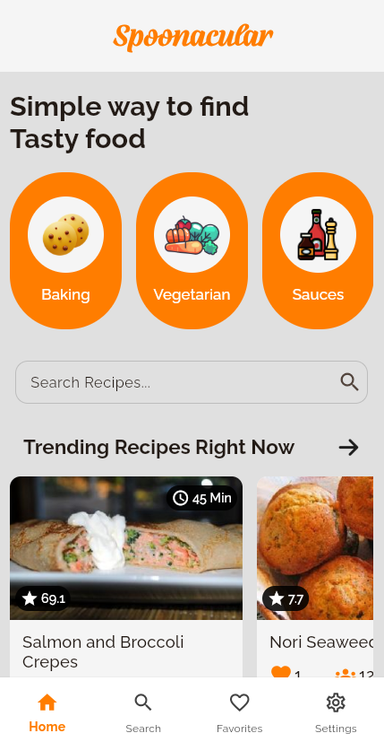
  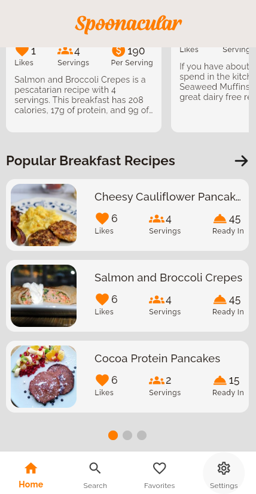
  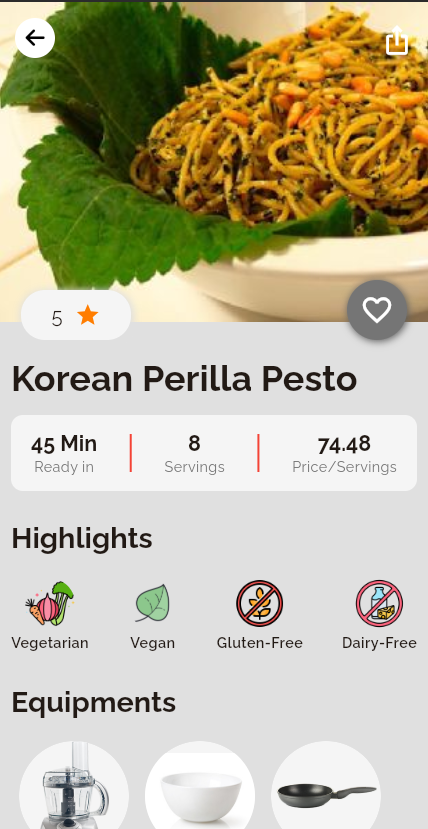
  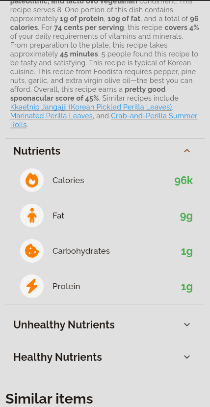
  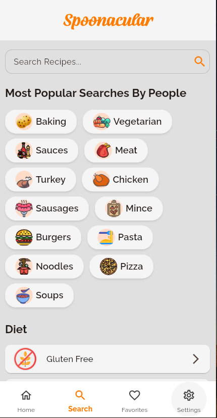
  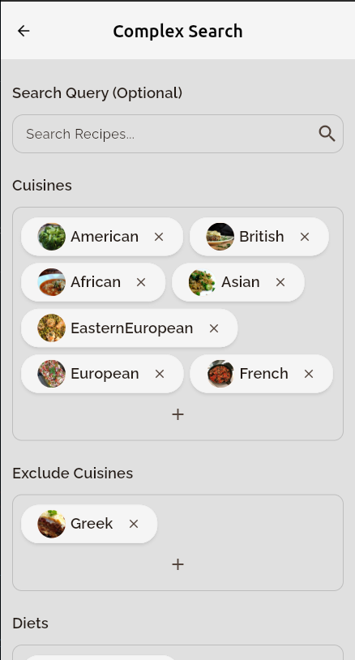
  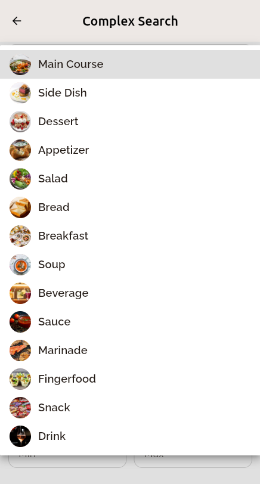
  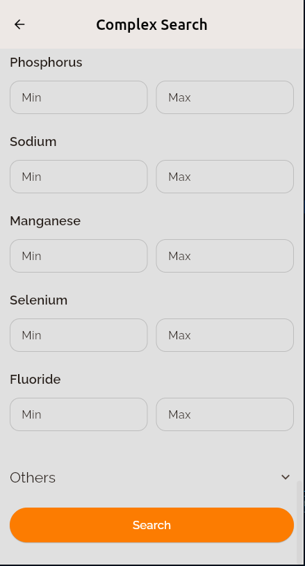
  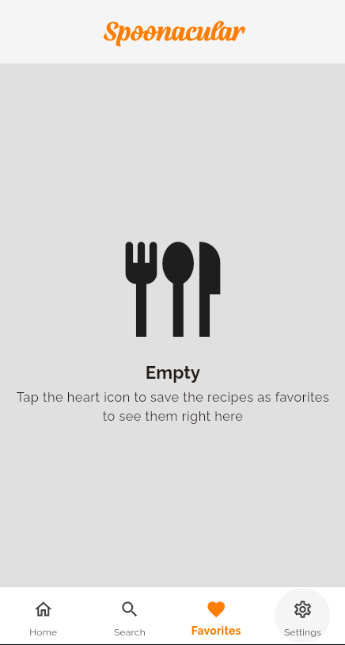
  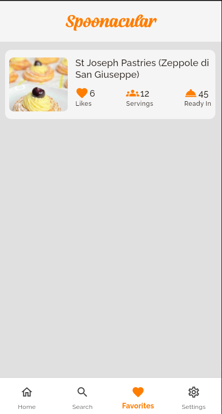
  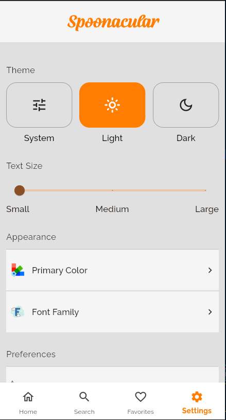
  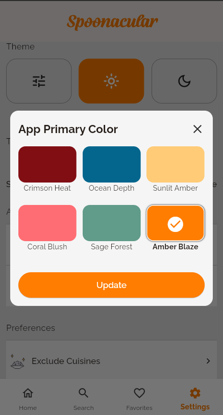
  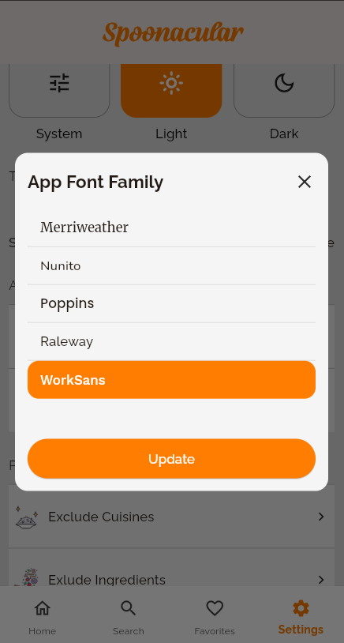
</p>

---

## Getting Started

### Prerequisites

- [Flutter SDK](https://docs.flutter.dev/get-started/install) (>=3.8.1)
- [Dart SDK](https://dart.dev/get-dart)
- [Android Studio](https://developer.android.com/studio) or [VS Code](https://code.visualstudio.com/)
- For desktop: CMake, GTK (Linux), Visual Studio (Windows), Xcode (macOS)

### Installation

1. **Clone the repository:**
   ```sh
   git clone <your-repo-url>
   cd Spoonacular-Recipes
   ```

2. **Install dependencies:**
   ```sh
   flutter pub get
   ```

3. **Set up environment variables:**
   - Copy `.env.example` to `.env` and add your Spoonacular API key.
   - Example:
     ```
     SPOONACULAR_API_KEY=your_api_key_here
     ```

### Running the App

- **Android/iOS:**
  ```sh
  flutter run
  ```
- **Web:**
  ```sh
  flutter run -d chrome
  ```
- **Windows:**
  ```sh
  flutter run -d windows
  ```
- **macOS:**
  ```sh
  flutter run -d macos
  ```
- **Linux:**
  ```sh
  flutter run -d linux
  ```

---

## Project Structure

```
.
├── lib/
│   ├── main.dart
│   ├── screens/
│   ├── constants/
│   ├── providers/
│   ├── theming/
│   └── ...
├── assets/
├── Screenshots/
├── test/
├── android/
├── ios/
├── linux/
├── macos/
├── windows/
├── web/
├── pubspec.yaml
├── analysis_options.yaml
├── .env
└── README.md
```

---

## Configuration

- **Environment Variables:**  
  Uses `flutter_dotenv` for loading secrets from `.env`.
- **Local Storage:**  
  Uses `hive_flutter` for storing user preferences and wishlist.
- **Theming:**  
  Theme state managed via Riverpod and persisted with Hive.

---

## Dependencies

Key dependencies:

- `flutter_riverpod` - State management
- `dio` - HTTP client
- `flutter_dotenv` - Environment variables
- `hive_flutter` - Local storage
- `font_awesome_flutter` - Icons
- `loading_animation_widget` - Loading animations
- `shimmer` - Shimmer loading effect
- `carousel_slider` - Carousels
- `smooth_page_indicator` - Page indicators
- `url_launcher` - Launch URLs
- `path_provider` - File system paths
- `visibility_detector` - Widget visibility

See full list in `pubspec.yaml`.

---

## Development & Contribution

1. **Linting:**  
   ```sh
   flutter analyze
   ```
2. **Testing:**  
   ```sh
   flutter test
   ```
3. **Contributions:**  
   Pull requests are welcome! Please open issues for suggestions or bugs.

---

## License

This project is licensed under the MIT License. See [LICENSE](LICENSE) for details.

---

## Acknowledgements

- [Spoonacular API](https://spoonacular.com/food-api)
- [Flutter](https://flutter.dev/)
- [All open-source package authors](https://pub.dev/)

---